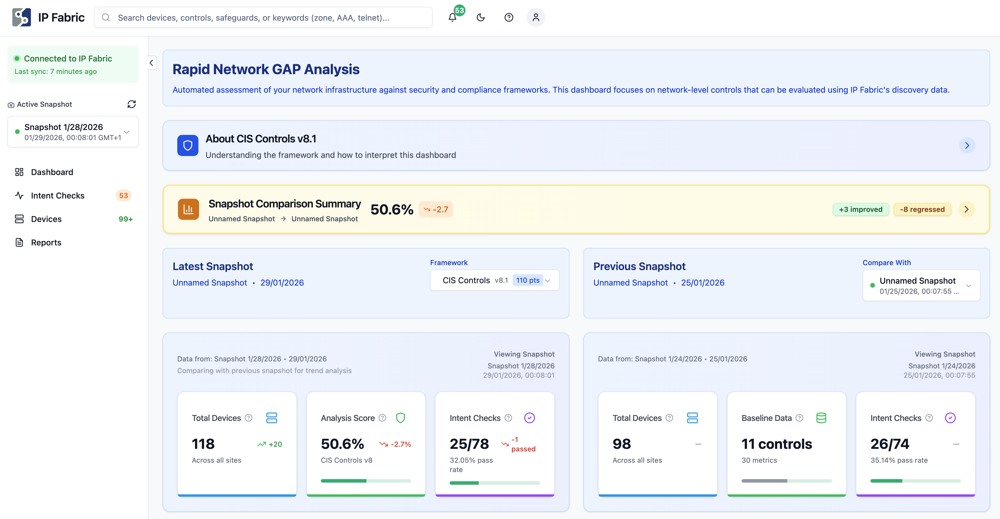

# Fabric Pulse

Fabric Pulse is a production-ready Next.js dashboard for IP Fabric network compliance monitoring, developed by **Daniel Rieger and Vincent Sampieri**. It supports multiple security frameworks with snapshot comparison and delta scoring.



## Features

- **Multi-Framework Compliance**: Support for CIS Controls v8.1, PCI DSS v4.0.1. NIST CSF v2.0, and NIS2 Directive EU 2022/2555
- **Snapshot Comparison**: Compare compliance scores between IP Fabric snapshots with visual delta analysis
- **Delta Scoring**: Track security posture changes over time with trend indicators (improving/declining)
- **Framework Switching**: Seamlessly switch between compliance frameworks in the UI
- **Network Insights**: Real-time device monitoring, intent checks, and alert management
- **IP Fabric Extension Mode**: Run standalone or embedded within IP Fabric platform
- **Wide API Support**: Compatible with IP Fabric API versions v6.3 through v7.10
- **Modern Stack**: Built with Next.js 14, TypeScript, Tailwind CSS, and Shadcn/ui

## Quick Start

### Prerequisites
- Docker and Docker Compose installed
- Access to an IP Fabric instance with API key

### 1. Clone the project
```bash
git clone <repository-url>
cd fabric-pulse
cp .env.example .env
```

### 2. Run with Docker
```bash
docker-compose up -d
```

### IP Fabric Extension Mode
When deployed as an IP Fabric extension, the dashboard automatically detects credentials from the platform. 

The extension package can be found in the `dist` folder:
- **`dist/fabric-pulse-extension.zip`**: This is the ZIP package that can be uploaded directly to the IP Fabric platform to load the extension.

To generate a new package, run:
```bash
npm run package
```

## Environment Variables

| Variable | Required | Description |
|----------|----------|-------------|
| `IPF_API_URL` | Optional | IP Fabric URL (pre-fills login) |
| `IPF_API_TOKEN` | Optional | IP Fabric API token (pre-fills login) |

## Compliance Frameworks

### CIS Controls v8.1
- 18 critical security controls with 153 safeguards
- Assesses ~29 network-relevant safeguards automatically
- Implementation Group (IG1/IG2/IG3) classification

### PCI DSS v4.0.1
- Payment Card Industry Data Security Standard
- Focuses on 6 of 12 requirements with network visibility
- Automated evidence collection for audits

### NIST Cybersecurity Framework v2.0
- Identify, Protect, Detect, Respond, Recover functions
- Network infrastructure maturity assessment
- Cross-industry applicability

### NIS2 Directive (EU 2022/2555)
- Articles 21 and 27 covering 8 security measure categories
- 40 checks across incident handling, continuity, supply chain, cryptography, access control, and more
- 200-point scoring scale with delta analysis requiring snapshot comparison

## Local Development

### Prerequisites
- Node.js 20+
- npm 10+

### Setup

```bash
npm install
cp .env.example .env.local
npm run dev
```

Visit `http://localhost:3000`

### Development Commands

| Command | Purpose |
|---------|---------|
| `npm run dev` | Start development server |
| `npm run type-check` | Check TypeScript errors (run before committing) |
| `npm run test:build` | Test production build (run before Docker build) |
| `npm run lint` | Run ESLint |
| `npm run test` | Run unit tests |

## Architecture

- **Frontend**: Next.js 14 (App Router), React 18, TypeScript
- **Styling**: Tailwind CSS, Shadcn/ui components
- **State**: Zustand for client state management
- **Auth**: NextAuth.js with credential provider
- **API**: IP Fabric REST API proxy with version auto-detection
- **Testing**: Vitest for unit tests

## Key Features Explained

### Snapshot Comparison
Select two IP Fabric snapshots to compare compliance scores side-by-side. The dashboard calculates deltas for each metric and displays trend indicators showing whether your security posture is improving or declining.

### Delta Scoring
Each metric shows:
- **Current value** from the latest snapshot
- **Previous value** from the comparison snapshot
- **Delta** with color-coded trend (green = improving, red = declining)
- **Contextual interpretation** based on the metric type

### Multi-Framework Support
Switch between compliance frameworks using the dropdown in the header. Each framework has its own:
- Scoring methodology
- Control categories
- Interpretation guidelines
- Documentation links

## Documentation

| Document | Purpose |
|----------|---------|
| [QUICK_START.md](./QUICK_START.md) | First-time setup guide |
| [DEVELOPMENT.md](./DEVELOPMENT.md) | Development best practices |
| [CONTRIBUTING.md](./CONTRIBUTING.md) | Contribution guidelines |
| [docs/design-system.md](./docs/design-system.md) | UI component guide |

## Troubleshooting

### Docker Issues
```bash
docker ps                              # Check container status
docker logs compliance-dashboard       # View logs
docker-compose build --no-cache        # Rebuild from scratch
```

### Common Issues
- **Port 3000 in use**: Change port in `docker-compose.yml`
- **API connection failed**: Verify IP Fabric URL and API key on login page
- **Build failures**: Run `npm run test:build` locally first

## Contributing

Please read [CONTRIBUTING.md](./CONTRIBUTING.md) for development workflow and code standards.

All contributions must pass:
- TypeScript type checking (`npm run type-check`)
- ESLint (`npm run lint`)
- Unit tests (`npm run test`)
- Build test (`npm run test:build`)

## License

MIT - See [LICENSE](./LICENSE) for details.
